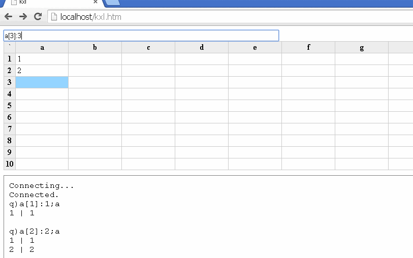

kxl - experimental spreadsheet UI for kdb+/k4/q
===============================================

Spreadsheets are a population stereotype for the visual programming paradigm. kxl is an exploratory prototype that matches the accessibility of the spreadsheet UI with the power of the array-based programming language.

My initial intention was to make k more accessible and understandable to beginners and business users. However, in creating this prototype, I found that not to be the case (and thus left it unfinished). The spreadsheet UI is too limiting and does not cleanly demonstrate how k works. I figured I would share this prototype anyway in case it sparks someone else's imagination.

Instead, I realized during the creation of this prototype that I would like an 'explain' command that essentially does a step-by-step evaluation of code, printing the intermediate results/data structures. 

For example:

      explain 1+/1+1 2 3
       +/       +
    10 <- 2 3 4 <- 1 2 3

Or simply printing at every step of the recursive ascent:

      explain 1+/1+1 2 3
    1 2 3 -> 2 3 4 -> 10

I noticed that Geo Carncross (geocar) uses a similar approach when explaining k code to beginners (see [https://news.ycombinator.com/item?id=9122299](https://news.ycombinator.com/item?id=9122299), [https://www.youtube.com/watch?v=kTrOg19gzP4](https://www.youtube.com/watch?v=kTrOg19gzP4), and [https://news.ycombinator.com/item?id=8476633](https://news.ycombinator.com/item?id=8476633)).

RodgerTheGreat/JohnEarnest added the 'explain' command to [oK](http://johnearnest.github.io/ok/index.html), his k5 REPL in JS. Try it by prefixing an expression with \x. 

For example:

	Welcome to oK v0.1
	(inspired by K5)
	  \x 1+/1+1 2 3
	1 + 1 2 3 --> 2 3 4
	1 + 2 --> 3
	3 + 3 --> 6
	6 + 4 --> 10
	1 +/ 2 3 4 --> 10
	10
	

Dependencies
------------
- [kdb+/k/q](http://kx.com/software-download.php)

To run
------
1. Drop html/ and kxl.q in the q directory.

2. Start the kdb+/k/q web socket server:
	- Linux: /path/to/q/l32/q kxl.q -p 80
	- Windows: /path/to/q/w32/q kxl.q -p 80

3. Browse to http://localhost/kxl.htm
